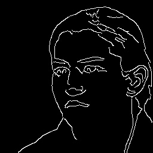
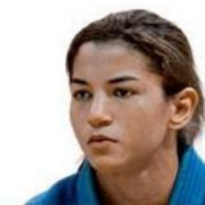

# ConditionalGAN - sketch2face
This is inspired from [seungjooli's work](https://github.com/seungjooli/ConditionalGAN) and tensorflow implementation based on [pix2pix](https://phillipi.github.io/pix2pix/). Converts a human face sketch image to a photo-like image.

## Output Example
After 2 epochs training, from randomly chosen test set:

| input | output | ground truth |
| :---: | :---: | :---: |
|  |  |  |
|  |  |  |
|  |  |  |
|  |  |  |

## Usage
There are now 2 methods for passing data to training model
	1. using tfrecords
	2. using previous approach of reading the image directory

tfrecord increases the time and storage efficiency of the data reading, and this is quite useful to train model on Google Colab.
Basically tfrecord is bundle of multiple images. To generate tfrecord out of the images I have created a script `tfrecord_gen.py`. See the usage of the script using

	$ python tfrecord_gen.py -h

Typically, you will have to set these flags: `-create_test`, `--train_size`, `--train_records`, `--test_size`

To download dataset and start training:

    $ python main.py --download_data=True

To train a model with downloaded data:

    $ python main.py

To train using tfrecords in google colab
    Generate tfrecord using
`    $ python tfrecord_gen.py -create_test --num_records 3 --train_size total_number_of_train_examples`
    To start training
`    $ python main.py --use_tfrecord=True --train_data_size=total_number_of_train_examples`
    **Note:** Also use --steps_per_test=5000 --steps_per_ckpt=10000 when training with large dataset to save space and speed up training

To test the model with a canvas UI:

    $ python main.py --mode=test_canvas

To test with an image

    $ python main.py --mode=test --test_img_path='path_to_image'

## Environment
- python3
- tensorflow-gpu (1.5)
- opencv-python (4.1.0)

- google-api-python-client (1.6.2)
- requests (2.13.0)
- tqdm (4.11.2)
